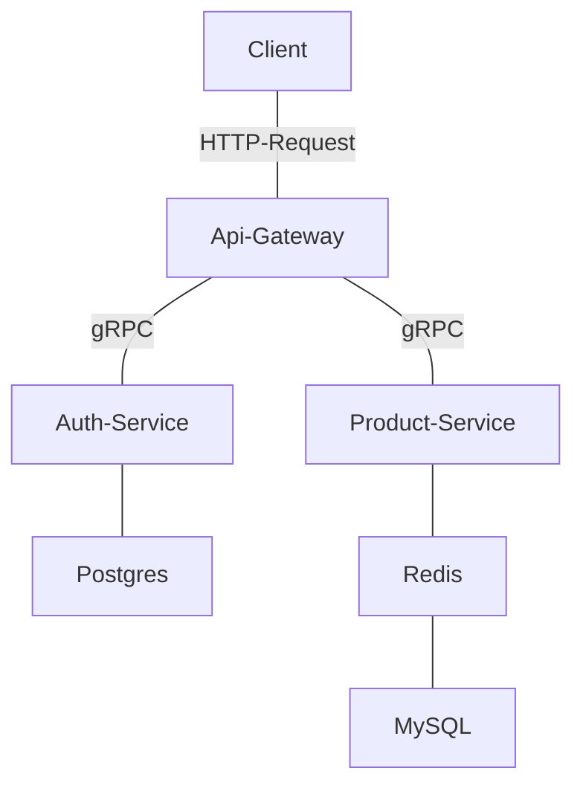

Golang gRPC Microservices
===============================================

This is a sample implementation of a microservices architecture using [gRPC](https://grpc.io/docs/languages/go/quickstart/). The architecture consists of two services: `auth-service` and `product-service` built with [gin](https://github.com/gin-gonic/gin) and [gorm](https://gorm.io/). Each service has its own database connector, and the services are accessed via `api-gateway` that accepts HTTP requests.

Postman Collection
--------------------
[](https://app.getpostman.com/run-collection/23338632-45d13d1b-e210-44a9-8fbb-dbb16aac0293?action=collection%2Ffork&collection-url=entityId%3D23338632-45d13d1b-e210-44a9-8fbb-dbb16aac0293%26entityType%3Dcollection%26workspaceId%3D375a5178-dc50-49c8-9ed3-5295f7908d43#?env%5Bgo-gin-microservices-grpc%5D=W3sia2V5IjoidXJsIiwidmFsdWUiOiJodHRwOi8vbG9jYWxob3N0OjgwODEvIiwiZW5hYmxlZCI6dHJ1ZSwidHlwZSI6ImRlZmF1bHQiLCJzZXNzaW9uVmFsdWUiOiJodHRwOi8vbG9jYWxob3N0OjgwODEvIiwic2Vzc2lvbkluZGV4IjowfSx7ImtleSI6InRva2VuIiwidmFsdWUiOiJleUpoYkdjaU9pSklVekkxTmlJc0luUjVjQ0k2SWtwWFZDSjkuZXlKMWMyVnlYMmxrSWpveExDSmhkV1FpT2xzaVoyOHRaMmx1TFcxcFkzSnZjMlZ5ZG1salpTMW5jbkJqSWwwc0ltVjRjQ0k2TVRZNE1qa3lNamt3TVN3aWFXRjBJam94TmpneU56VXdNVEF4ZlEuTFJYYmVDeVdBdWtLTHZyTmgtcjFVX1BDajlmSVNaT1A3WDU2bkFHUG43RSIsImVuYWJsZWQiOnRydWUsInR5cGUiOiJzZWNyZXQiLCJzZXNzaW9uVmFsdWUiOiJleUpoYkdjaU9pSklVekkxTmlJc0luUjVjQ0k2SWtwWFZDSjkuZXlKMWMyVnlYMmxrSWpveExDSmhkV1FpT2xzaVoyOHRaMmx1TFcxcFkzSnZjMlZ5ZG1salpTMW5jbkJqSWwwc0ltVjRjQ0k2TVRZNE1qa3lNamt3TVN3aWFXRjBJam94TmpneS4uLiIsInNlc3Npb25JbmRleCI6MX1d)

Prerequisite
-------------------
- Golang
- Makefile
- Docker
- Protobuf

Building and Running the Services
---------------------------------

To build and run the services, follow these steps:

1.  Clone this repository.
2.  Navigate to the `go-gin-microservices-grpc` directory.
2.  Run `make up_build` to build the Docker images for the services.
3.  Server will be running at http://localhost:8081/

Once the services are running, you can test them with Postman by sending HTTP requests to the gateway service.

Directory Structure
-------------------

The directory structure for the services is as follows:

```
.
├── Makefile
├── README.md
├── docker-compose.yml
├── api-gateway
│   ├── Dockerfile
│   ├── go.mod
│   ├── go.sum
│   ├── handlers
│   │   ├── authentication.go
│   │   └── products.go
│   ├── main.go
│   ├── middleware
│   │   └── verify.go
│   ├── pb
│   │   ├── product.pb.go
│   │   ├── product.proto
│   │   ├── product_grpc.pb.go
│   │   ├── users.pb.go
│   │   ├── users.proto
│   │   └── users_grpc.pb.go
│   └── utils
│       ├── grpc.go
│       └── response.go
├── auth-service
│   ├── Dockerfile
│   ├── config
│   │   └── database.go
│   ├── go.mod
│   ├── go.sum
│   ├── main.go
│   ├── models
│   │   ├── auto_migrate.go
│   │   └── users.go
│   ├── pb
│   │   ├── users.pb.go
│   │   ├── users.proto
│   │   └── users_grpc.pb.go
│   └── server
│       └── users.go
└── product-service
    ├── Dockerfile
    ├── config
    │   ├── database.go
    │   └── redis.go
    ├── go.mod
    ├── go.sum
    ├── main.go
    ├── models
    │   ├── auto_migrate.go
    │   └── products.go
    ├── pb
    │   ├── product.pb.go
    │   ├── product.proto
    │   └── product_grpc.pb.go
    └── server
        └── products.go
```

System Architecture Diagram
----------

